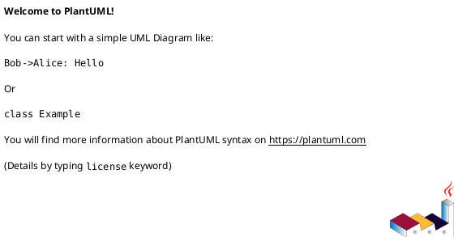

# PlantUML Diagramlarını Kullanma Rehberi

ParseFlow PlantUML diagramlarını görüntülemek ve kullanmak için pratik çözümler.

---

## 🎯 ÖNERİLEN ÇÖZÜMLER

| Yöntem | Kolay | Hızlı | Etkileşimli | EA Entegrasyon |
|--------|-------|-------|-------------|----------------|
| **VS Code Extension** | ✅ | ✅ | ✅ | ⚠️ (Export gerekli) |
| **PlantUML Online** | ✅✅ | ✅ | ❌ | ⚠️ (Export gerekli) |
| **IntelliJ IDEA** | ✅ | ✅ | ✅ | ⚠️ (Export gerekli) |
| **Local PlantUML JAR** | ⚠️ | ✅ | ❌ | ⚠️ (Export gerekli) |
| **PlantUML Server (Docker)** | ⚠️ | ✅✅ | ✅ | ⚠️ (Export gerekli) |

---

## 🚀 YÖNTEM 1: Visual Studio Code (ÖNERİLEN)

### Avantajları
- ✅ Canlı preview
- ✅ Otomatik güncelleme
- ✅ SVG/PNG/PDF export
- ✅ Syntax highlighting
- ✅ Zoom in/out
- ✅ Ücretsiz

### Kurulum

#### 1. VS Code'u İndir ve Yükle
```
https://code.visualstudio.com/
```

#### 2. PlantUML Extension'ı Yükle

**Yöntem A - Extension Marketplace:**
```
1. VS Code'u aç
2. Sol panelden Extensions ikonuna tıkla (Ctrl+Shift+X)
3. Ara: "PlantUML"
4. "PlantUML" by jebbs - Install
```

**Yöntem B - Komut satırı:**
```bash
code --install-extension jebbs.plantuml
```

#### 3. Graphviz'i Yükle (Gerekli)

**Windows:**
```
1. İndir: https://graphviz.org/download/
2. Installer'ı çalıştır
3. "Add to PATH" seçeneğini işaretle
4. VS Code'u yeniden başlat
```

**macOS:**
```bash
brew install graphviz
```

**Linux (Ubuntu/Debian):**
```bash
sudo apt-get install graphviz
```

#### 4. PlantUML Dosyasını Aç ve Görüntüle

```
1. VS Code'da ParseFlow_ActivityDiagram.puml dosyasını aç
2. Alt+D tuşuna bas (veya sağ tık > "Preview Current Diagram")
3. Canlı preview açılır!
```

### Kullanım Komutları

| Kısayol | Açıklama |
|---------|----------|
| **Alt+D** | Preview aç/kapat |
| **Ctrl+Shift+P** → "PlantUML: Export Current Diagram" | PNG/SVG/PDF export |
| **Ctrl+Shift+P** → "PlantUML: Export Workspace Diagrams" | Tüm .puml dosyalarını export et |

### Export Ayarları

VS Code Settings (Ctrl+,) → "plantuml" ara:

```json
{
    "plantuml.exportFormat": "svg",
    "plantuml.exportSubFolder": false,
    "plantuml.exportOutDir": "diagrams_export"
}
```

---

## 🌐 YÖNTEM 2: PlantUML Online Server (EN HIZLI)

### Avantajları
- ✅ Kurulum gerektirmez
- ✅ Anında sonuç
- ✅ PNG/SVG export
- ✅ Paylaşılabilir link

### Kullanım

#### 1. Online PlantUML Server'a Git
```
http://www.plantuml.com/plantuml/uml/
```

#### 2. PlantUML Kodunu Yapıştır

```
1. ParseFlow_ActivityDiagram.puml dosyasını text editor ile aç
2. İçeriğini kopyala
3. PlantUML server'daki text area'ya yapıştır
4. "Submit" veya otomatik render
```

#### 3. Export

```
- PNG: Sağ tık > Save Image As
- SVG: URL'deki /uml/ kısmını /svg/ ile değiştir
- PDF: Tarayıcıdan Print > Save as PDF
```

### Alternatif Online Sunucular

```
https://www.planttext.com/          - Clean UI
https://plantuml.github.io/         - GitHub hosted
https://kroki.io/                   - Multi-format support
```

---

## 💼 YÖNTEM 3: IntelliJ IDEA / PyCharm

### Kurulum

```
1. File > Settings > Plugins
2. Ara: "PlantUML Integration"
3. Install
4. Restart IDE
```

### Kullanım

```
1. .puml dosyasını aç
2. Sağ panelde otomatik preview görünür
3. Sağ tık > "Copy/Export Diagram"
```

---

## ⚙️ YÖNTEM 4: PlantUML Standalone JAR

### Avantajları
- ✅ Offline çalışır
- ✅ Batch processing
- ✅ Komut satırı
- ✅ Otomasyona uygun

### Kurulum

#### 1. Java'yı Yükle (Gerekli)

**Windows:**
```
https://www.java.com/en/download/
```

**Linux:**
```bash
sudo apt-get install default-jre
```

#### 2. PlantUML JAR'ı İndir

```
https://plantuml.com/download
```

**Veya direkt link:**
```bash
wget https://github.com/plantuml/plantuml/releases/download/v1.2024.3/plantuml-1.2024.3.jar
```

#### 3. Graphviz'i Yükle (Gerekli)

Yöntem 1'deki Graphviz kurulum adımlarını takip edin.

### Kullanım

#### Tek Dosya Render

```bash
java -jar plantuml.jar ParseFlow_ActivityDiagram.puml
```

**Çıktı:** `ParseFlow_ActivityDiagram.png`

#### Tüm .puml Dosyalarını Render

```bash
java -jar plantuml.jar *.puml
```

#### SVG Formatında Export

```bash
java -jar plantuml.jar -tsvg ParseFlow_ActivityDiagram.puml
```

#### PDF Export

```bash
java -jar plantuml.jar -tpdf ParseFlow_ActivityDiagram.puml
```

#### Farklı Klasöre Export

```bash
java -jar plantuml.jar -o output_folder *.puml
```

### Batch Script (Windows)

`render_diagrams.bat` oluşturun:

```batch
@echo off
echo Rendering PlantUML diagrams...

java -jar plantuml.jar -tsvg ParseFlow_ActivityDiagram.puml
java -jar plantuml.jar -tsvg ParseFlow_SequenceDiagram.puml
java -jar plantuml.jar -tsvg ParseFlow_UseCaseDiagram.puml

echo Done! SVG files created.
pause
```

### Bash Script (Linux/macOS)

`render_diagrams.sh` oluşturun:

```bash
#!/bin/bash
echo "Rendering PlantUML diagrams..."

java -jar plantuml.jar -tsvg ParseFlow_*.puml

echo "Done! SVG files created."
```

Çalıştırmak için:
```bash
chmod +x render_diagrams.sh
./render_diagrams.sh
```

---

## 🐳 YÖNTEM 5: PlantUML Server (Docker)

### Kurulum

```bash
docker pull plantuml/plantuml-server
docker run -d -p 8080:8080 plantuml/plantuml-server
```

### Kullanım

```
1. Tarayıcıda: http://localhost:8080
2. PlantUML kodunu yapıştır
3. Render ve export
```

---

## 📊 EA'YE AKTARMA

PlantUML diagramlarını EA'ye aktarmak için:

### Yöntem A: SVG/PNG Import

```
1. PlantUML'den SVG veya PNG export et
2. EA'de: Diagram > Insert > Image
3. SVG/PNG dosyasını seç
4. Diagram'a yerleştir
```

**Avantaj:** Görsel olarak mükemmel
**Dezavantaj:** EA'de düzenlenemez (statik görüntü)

### Yöntem B: Manuel Recreate

```
1. PlantUML diagram'ını referans olarak aç (VS Code preview)
2. EA'de yeni diagram oluştur
3. PlantUML'deki elementleri EA'ye manuel olarak ekle
4. Relationship'leri çiz
```

**Avantaj:** EA'de tam düzenlenebilir
**Dezavantaj:** Manuel iş gerektirir

### Yöntem C: PlantUML Notes Ekle

```
1. EA'de diagram oluştur
2. Diagram'a Note element ekle
3. Note'un içine PlantUML source kodunu yapıştır
4. Böylece diagram + source birlikte tutulur
```

**Avantaj:** Kaynak kodu korunur
**Dezavantaj:** İki versiyonu sync tutmak gerekir

---

## 🎨 GÖRSEL KALİTE KARŞILAŞTIRMA

| Format | Kalite | Zoom | EA Import | Dosya Boyutu |
|--------|--------|------|-----------|--------------|
| **PNG** | ⭐⭐⭐ | ❌ | ✅ | Orta |
| **SVG** | ⭐⭐⭐⭐⭐ | ✅ | ✅ | Küçük |
| **PDF** | ⭐⭐⭐⭐⭐ | ✅ | ⚠️ | Orta |
| **Native EA** | ⭐⭐⭐⭐ | ✅ | ✅ | Küçük |

**Öneri:** SVG kullanın (vektörel, zoom-friendly, küçük dosya)

---

## 📚 PARSE FLOW DİAGRAMLARI

Mevcut PlantUML dosyalarınız:

```
ParseFlow_ActivityDiagram.puml    - 325 satır, detaylı aktivite diyagramı
ParseFlow_SequenceDiagram.puml    - 478 satır, 5 fazlı sequence diyagram
ParseFlow_UseCaseDiagram.puml     - 150+ satır, aktörler ve use case'ler
```

Her biri şunları içeriyor:
- ✅ Detaylı notes ve açıklamalar
- ✅ Database tablo referansları
- ✅ Thread pool ve parallel execution detayları
- ✅ Phase-based organization
- ✅ Code snippet'leri

---

## 🎯 HIZLI BAŞLANGIÇ

### En Hızlı Yöntem (5 dakika):

```
1. VS Code indir ve yükle
2. PlantUML extension yükle
3. Graphviz yükle
4. ParseFlow_ActivityDiagram.puml aç
5. Alt+D tuşuna bas
6. 🎉 Diagram görüntüleniyor!
```

### Hiç Kurulum İstemiyorum:

```
1. http://www.plantuml.com/plantuml/uml/ aç
2. ParseFlow_ActivityDiagram.puml içeriğini kopyala-yapıştır
3. 🎉 Diagram görüntüleniyor!
```

---

## 🔧 SORUN GİDERME

### "Graphviz not found" hatası

**Çözüm:**
```
1. Graphviz yükle: https://graphviz.org/download/
2. PATH'e eklendiğinden emin ol
3. VS Code'u yeniden başlat
```

### Türkçe karakterler bozuk

**Çözüm:**
VS Code'da dosyayı UTF-8 encoding ile kaydet:
```
1. Sağ altta encoding gösterilir
2. Tıkla > "Save with Encoding"
3. "UTF-8" seç
```

### Diagram çok büyük

**Çözüm A - PlantUML scale:**
```plantuml
@startuml
scale 0.8
' diagram içeriği
@enduml
```

**Çözüm B - VS Code zoom:**
```
Ctrl + Mouse Wheel (zoom in/out)
```

---

## 💡 İPUÇLARI

### 1. Live Editing
VS Code'da PlantUML dosyasını düzenlerken preview otomatik güncellenir.

### 2. Export Shortcuts
```
Ctrl+Shift+P > "PlantUML: Export"
```

### 3. Multiple Diagrams
Bir .puml dosyasında birden fazla diagram olabilir:


### 4. Include Files
Ortak tanımları paylaşmak için:
```plantuml
!include common_styles.puml
```

### 5. Custom Themes
```plantuml
!theme cerulean
```

---

## 📖 DAHA FAZLA BİLGİ

- **PlantUML Resmi Dökümantasyon:** https://plantuml.com/
- **PlantUML Cheat Sheet:** https://ogom.github.io/draw_uml/plantuml/
- **VS Code Extension:** https://marketplace.visualstudio.com/items?itemName=jebbs.plantuml
- **PlantUML Themes:** https://bschwarz.github.io/puml-themes-gallery/

---

## ✅ SONUÇ

**En Pratik Çözüm:**
**VS Code + PlantUML Extension** kullanın.

1. Kurulum 5 dakika
2. Canlı preview
3. Export kolaylığı
4. Ücretsiz

**Hiç Kurulum İstemiyorsanız:**
**PlantUML Online** kullanın.

1. Anında başla
2. Paylaşılabilir
3. Export yapabilir

PlantUML dosyalarınız zaten mükemmel - sadece görüntülemek için doğru araçları kullanın! 🎉

---

**Son Güncelleme:** 2026-01-13
**PlantUML Versiyonu:** 1.2024.x+
**Uyumlu:** Windows, macOS, Linux
